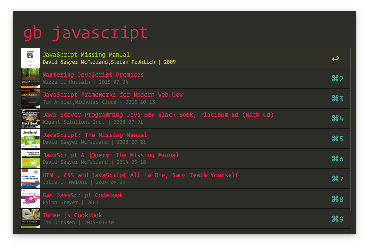

# alfred-google-books [](https://travis-ci.org/dameck/alfred-google-books)

> Alfred 3 workflow to search for Google Books on https://books.google.com/




## Install

```
$ npm install --global alfred-google-books
```
or
```
$ yarn global add alfred-google-books
```

*Requires [Node.js](https://nodejs.org) 4+ and the Alfred [Powerpack](https://www.alfredapp.com/powerpack/).*


## Usage

In Alfred, type `gb`, <kbd>Enter</kbd>, and your query.

## License

MIT © [Damian Framke](http://www.bytesolutions.de)

*Contributions and feedback are welcome and encouraged!*
